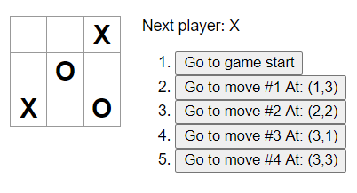
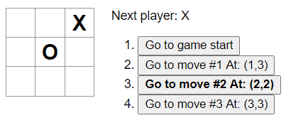
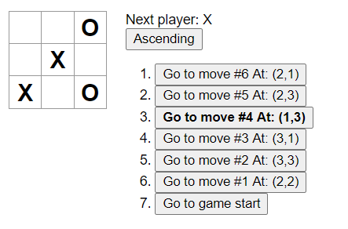
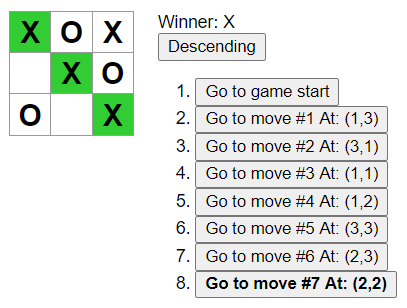

# Tic Tac Toe

If you're new to React and want a quick overview of the library, then following [this](https://reactjs.org/tutorial/tutorial.html) tutorial on their official website could really be helpful. The tutorial explains how to build a tic-tac-toe game using React and there are some [further improvements](https://reactjs.org/tutorial/tutorial.html#wrapping-up) that are left as an exercise to the readers. Here I am going to explain my solution to those listed improvements.

# Usage

```bash
git clone https://github.com/ssmkhrj/tic-tac-toe-react.git
cd tic-tac-toe-react
npm install
npm start
```

# Starter Code

[This](https://codepen.io/gaearon/pen/gWWZgR?editors=0010) is where the official React tutorial ended. So, we will be starting from here onwards.

## 1. Display the location for each move

In this improvement we need to add the location where the move occurred along with the move number. So, if our first move is at square `(1,1)`, then our button should say `Go to #1 At: (1,1)`.

Following are the changes that we make in order to achieve this:

- In the `Game` component every item in the `history` state stores a snapshot of the board which is stored in the `squares` property. In addition to the `squares` property we add a `location` property to store the location where the move was made. So our state now looks like this:

```js
this.state = {
  history: [
    {
      squares: Array(9).fill(null),
      location: null,
    },
  ],
  stepNumber: 0,
  xIsNext: true,
};
```

- Then we modify the `handleClick` method to update the location accordingly. We make use of the `i` parameter to get the location at which the click happened, but since `i` is the one-dimensional index we need to break it down into row and column position. So our `handleClick` method now looks like this.

```js
handleClick(i) {
  ...
  const row = Math.floor(i / 3) + 1;
  const col = (i % 3) + 1;
  this.setState({
    history: history.concat([
      {
        squares: squares,
        location: `(${row},${col})`,
      },
    ]),
    ...
  });
}
```

- Finally we update the `render` method to display the location. This how it looks after the update.

```js
render() {
    ...
    const moves = history.map((step, move) => {
      const desc = move
        ? `Go to move #${move} At: ${step.location}`
        : "Go to game start";
      return (
        <li key={move}>
          <button onClick={() => this.jumpTo(move)}>{desc}</button>
        </li>
      );
    });
    ...
}
```

This is how the buttons look now:



## Bold the currently selected item in the move list

In this improvement we need to highlight (bold) the move that the user is currently viewing.

Following are the changes that we make in order to achieve this:

- Firstly we add a class `highlight` to our css file..

```css
.highlight {
  font-weight: bold;
}
```

- Then we add the `highlight` class dynamically to the buttons if `move === this.state.stepNumber`, which is `true` only for the button thats currently selected. This how the `render` method looks after the update.

```js
render() {
    ...
    const moves = history.map((step, move) => {
      const desc = move
        ? `Go to move #${move} At: ${step.location}`
        : "Go to game start";
      return (
        <li key={move}>
          <button
            className={move === this.state.stepNumber ? "highlight" : ""}
            onClick={() => this.jumpTo(move)}
          >
            {desc}
          </button>
        </li>
      );
    });
    ...
}
```

This is how the buttons look now:



## Use two loops to render the squares

In this improvement we need to make the render method of the Board component more efficient. Currently we have hardcoded the 9 squares that we need to render, which isn't quite neat, instead we can use a nested loop for this.

Following are the changes that we make in order to achieve this:

- We add a `renderBoard` method that returns an array containing all the squares and we simply call this method in `render`. Also, we need to add keys at appropriate places for React to be happy. So, our board component now looks like this.

```js
class Board extends React.Component {
  renderSquare(i) {
    return (
      <Square
        key={i}
        value={this.props.squares[i]}
        onClick={() => this.props.onClick(i)}
      />
    );
  }

  renderBoard() {
    const numRows = 3;
    const numCols = 3;
    const board = [];
    for (let r = 0; r < numRows; r++) {
      let row = [];
      for (let c = 0; c < numCols; c++) {
        row.push(this.renderSquare(r * numCols + c));
      }
      board.push(
        <div className="board-row" key={r}>
          {row}
        </div>
      );
    }
    return board;
  }

  render() {
    return <div>{this.renderBoard()}</div>;
  }
}
```

## Sort the moves in either ascending or descending order

In this improvement we need to add a button that toggles the order in which the moves are displayed. Currently it is always displayed in ascending order (_i.e from game start to the latest move_), but we need to add a button to toggle this ordering from ascending to descending (_i.e from latest move to game start_) and visa-versa.

Following are the changes that we make in order to achieve this:

- We add a `isDescending` state in the Game component to store the ordering of the moves. Initially in the constructor it is set to `false`. This is how our state looks now.

```js
this.state = {
  history: [
    {
      squares: Array(9).fill(null),
      location: null,
    },
  ],
  stepNumber: 0,
  xIsNext: true,
  isDescending: false,
};
```

- Next, we add a button to the `render` method that dynamically says "Ascending" or "Descending" based on the `isDescending` state. Also, we add a click handler `toggleOrdering` to the button which we will define next. This is how our render looks after this.

```js
render() {
    ...
    return (
      <div className="game">
        ...
        <div className="game-info">
          <div>{status}</div>
          <button onClick={() => this.toggleOrdering()}>
            {this.state.isDescending ? "Ascending" : "Descending"}
          </button>
          <ol>{moves}</ol>
        </div>
      </div>
    );
}
```

- Now we define the `toggleOrdering` click handler. It simply toggles the `isDescending` state.

```js
toggleOrdering() {
  this.setState({
    isDescending: !this.state.isDescending,
  });
}
```

- Finally we reverse the `moves` variable in the `render` method based on the `isDescending` state. This is how our render method looks now.

```js
render() {
    ...
    if (this.state.isDescending) moves.reverse();
    return (
      ...
    );
}
```

This is how the moves look in Descending order.



## Highlight the three squares that caused the win.

In this improvement we need to highlight the three squares that caused the win.

Following are the changes that we make in order to achieve this:

- First we need to somehow get the positions of the winning squares, if we carefully look at how the `calculateWinner` function is defined we would observe that the `lines` array contains all the possible winning positions and we can easily return the winning position using this. So we now return an object that stores both the winner and wining positions. This is how the function looks now.

```js
function calculateWinner(squares) {
  const lines = [
    [0, 1, 2],
    [3, 4, 5],
    [6, 7, 8],
    [0, 3, 6],
    [1, 4, 7],
    [2, 5, 8],
    [0, 4, 8],
    [2, 4, 6],
  ];
  for (let i = 0; i < lines.length; i++) {
    const [a, b, c] = lines[i];
    if (squares[a] && squares[a] === squares[b] && squares[a] === squares[c]) {
      return {
        winner: squares[a],
        positions: lines[i],
      };
    }
  }
  return {
    winner: null,
    positions: [],
  };
}
```

- Since we have modified the `calculateWinner` function we need to make corrections in the `handleClick` and `render` method because now the function doesn't directly return the winner but it returns an object.

```js
handleClick(i) {
    ...
    if (calculateWinner(squares).winner || squares[i]) {
      return;
    }
    ...
  }
```

```js
render() {
    ...
    const winInfo = calculateWinner(current.squares);
    ...
    if (winInfo.winner) {
      status = "Winner: " + winInfo.winner;
    } else {
      status = "Next player: " + (this.state.xIsNext ? "X" : "O");
    }
    return (
      ...
    );
  }
```

- Next we pass a prop `winningSqs` to the `Board` component that contains the winning positions in an array or an empty array depending on whether the game is won or not.

```js
<Board
  squares={current.squares}
  onClick={(i) => this.handleClick(i)}
  winningSqs={winData.positions}
/>
```

- Then we pass a prop `isWinningSq` to the `Square` component that stores whether that square is a winning square or not. So this how the `renderSquare` method looks now.

```js
function renderSquare(i) {
  return (
    <Square
      key={i}
      value={this.props.squares[i]}
      onClick={() => this.props.onClick(i)}
      isWinningSq={this.props.winningSqs.includes(i)}
    />
  );
}
```

- Finally lets add a class `winning-sq` to our css file and add this class dynamically to the button in the `Square` component.

```css
.winning-sq {
  background-color: limegreen;
}
```

```js
function Square(props) {
  return (
    <button
      className={`square ${props.isWinningSq ? "winning-sq" : ""}`}
      onClick={props.onClick}
    >
      {props.value}
    </button>
  );
}
```

This how the board looks like when someone wins


